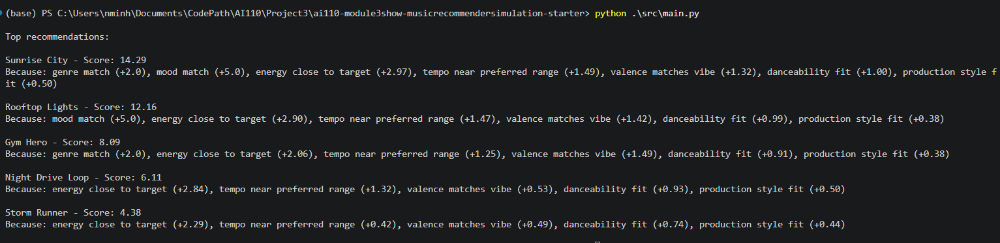
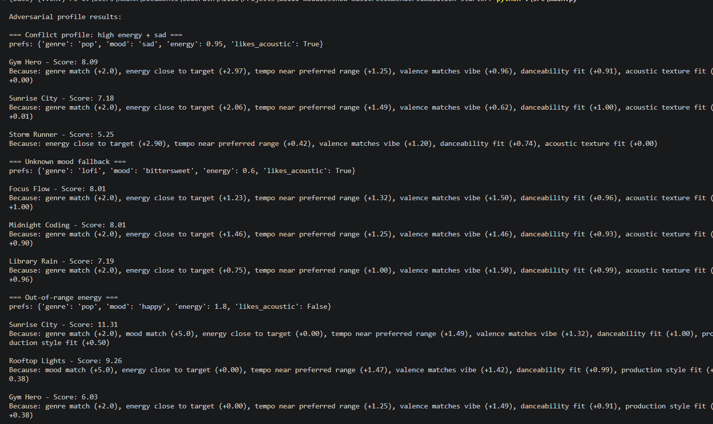

# 🎵 Music Recommender Simulation

## Project Summary

This project builds a small music recommender from a hand-made song catalog.
The system scores songs using user preferences and audio-style features, then ranks the best matches.
It also includes simple fairness improvements so the top results are not dominated by one artist or one genre.

Recent updates:
- Refactored models into `src/models.py` (`Song`, `UserProfile`)
- Kept scoring and ranking logic in `src/recommender.py`
- Consolidated duplicate diversity penalty logic into one shared helper
- Improved CLI output readability with a ranked ASCII table

---

## How The System Works

Each song in the CSV catalog has 16 features:
- `genre`, `mood`, `mood_tag`
- `energy`, `tempo_bpm`, `valence`, `danceability`, `acousticness`
- `popularity`, `release_decade`
- `instrumentalness`, `vocal_presence`, `brightness`
- `artist`, `title`, `id`

The user profile includes:
- favorite genre
- favorite mood
- target energy
- whether the user likes acoustic tracks

The scoring system combines 14 weighted factors (~22.2 max points):
- Exact matches for genre, mood, and mood tags
- Gaussian similarity for numeric features (energy, tempo, valence, danceability, acousticness, popularity, instrumentalness, vocal presence, brightness)
- Release decade proximity scoring

The current weight-shift experiment uses:
- lower genre weight
- higher energy weight

After base scoring, a diversity penalty is applied during ranking:
- repeated artist in current top results: `-2.0`
- repeated genre in current top results: `-1.0`

The project provides both a functional API (`recommend_songs`) and an OOP interface (`Recommender` class).

---

## Getting Started

### Setup

1. Create a virtual environment (optional):

```bash
python -m venv .venv
```

2. Activate it:

```bash
# Windows
.venv\Scripts\activate

# Mac/Linux
source .venv/bin/activate
```

3. Install dependencies:

```bash
pip install -r requirements.txt
```

Dependencies: `pandas`, `pytest`, `streamlit`

### Run the App

From the project root:

```bash
python -m src.main
```

Alternative (also supported):

```bash
python src/main.py
```

The terminal output is shown as a formatted ASCII table with:
- rank
- title
- artist
- score
- reasons for each score

### Run Tests

```bash
python -m pytest
```

---

## Experiments

Main experiments completed:
- Adversarial profile: high energy + sad mood
- Unknown mood profile: "bittersweet"
- Out-of-range energy profile
- Weight shift sensitivity test (energy up, genre down)
- Diversity penalty test (artist/genre repetition penalties)
- Mood alias sensitivity check (`upbeat` vs `happy`)

Observed behavior:
- Rankings are very sensitive to energy weighting.
- Strong single signals can dominate mixed preferences.
- Diversity penalty helps avoid near-duplicate top results.

---

## Project Structure

```
src/
  __init__.py      # Package exports
  models.py        # Song and UserProfile dataclasses
  recommender.py   # Core scoring and ranking logic, functional API + Recommender class
  main.py          # CLI runner with ranked ASCII table output
tests/
  test_recommender.py  # Unit tests
data/
  songs.csv        # 10-song catalog with 16 features
assets/
  image.png        # Project image asset
  image-1.png      # Additional project image asset
model_card.md      # Model card with bias and evaluation notes
reflection.md      # Project reflection
```

---

## Assets

Project images are stored in `assets/`:
- 
- 

---

## Limitations and Risks

- The catalog is very small (10 songs).
- Mood handling is simple and can miss nuanced moods.
- Exact match features can overfit narrow preferences.
- Diversity penalty is rule-based and not personalized.

See `model_card.md` for a fuller reflection on bias and evaluation.

---

## Reflection and Model Card

Project reflection and analysis are documented in:
- [Model Card](model_card.md)
- [Reflection Notes](reflection.md)

